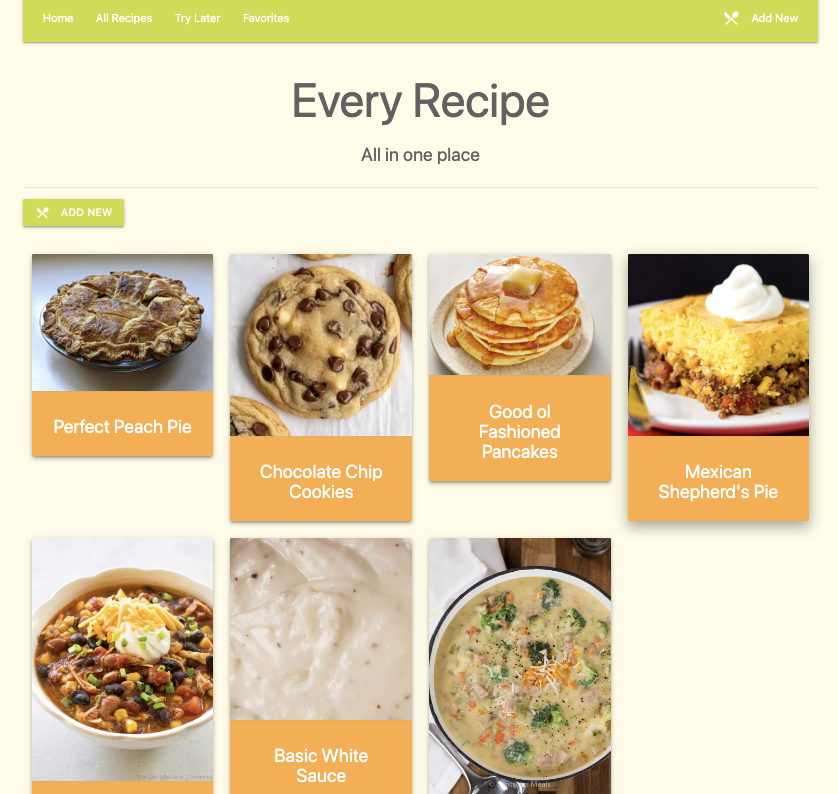
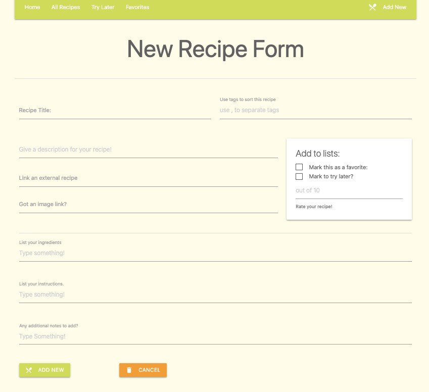
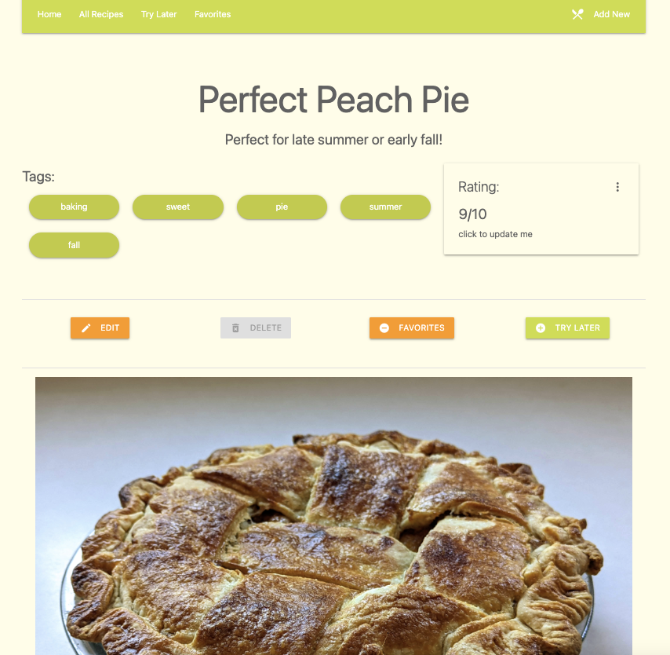
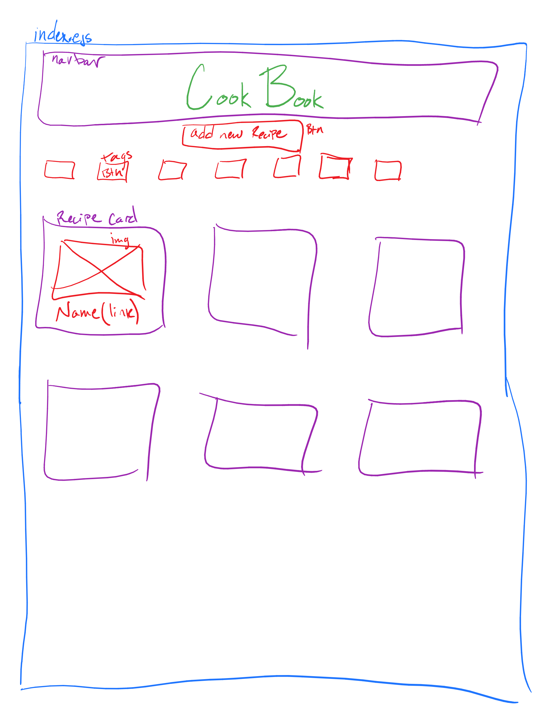
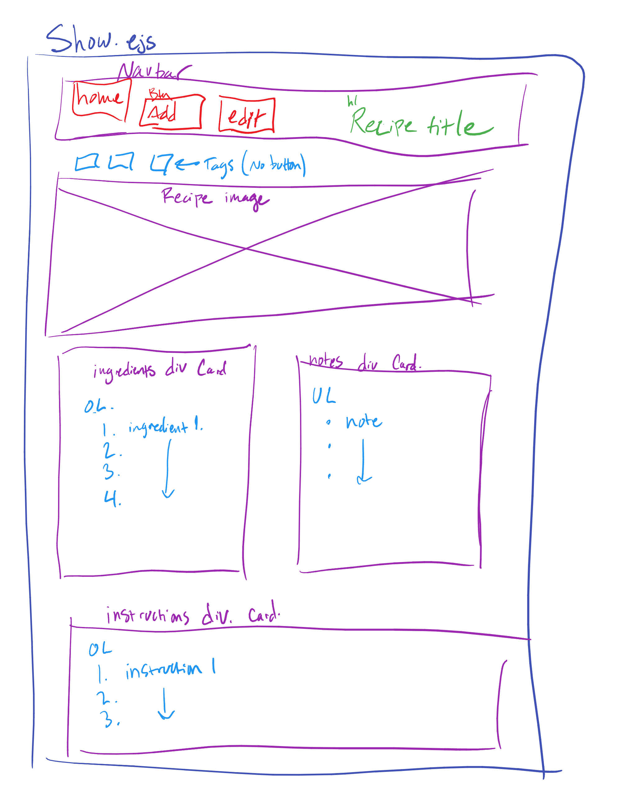
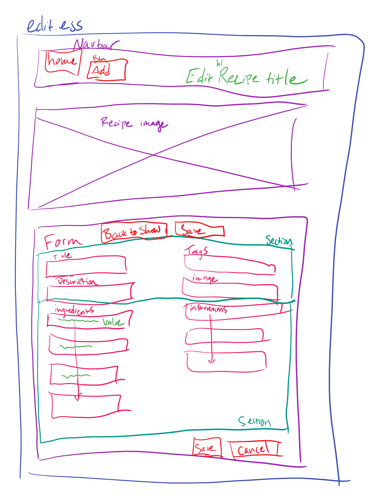
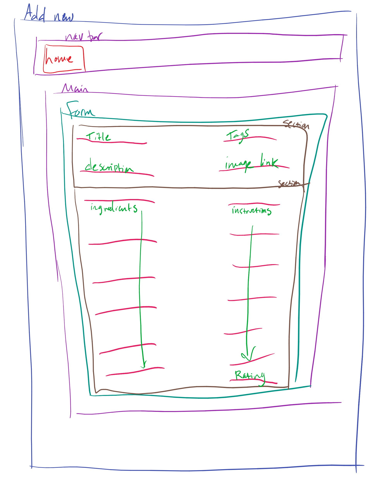
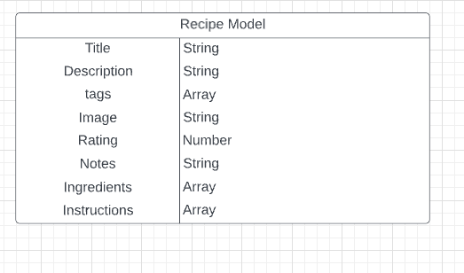

# CookBook Web App

### A place to store, view, edit, and search all of your saved recipes

---
## Description

### **Let's face it:**
Food is life. You (preferrably) need it daily, and multiple times a day! Meal prepping is an essential skill, and building a recipe library is vital for those who cook frequently. "Variety is the spice of life" as they say, and trying new recipes comes with the territory. As your recipe library builds, it gets difficult to remember them all, and how to store them! 
### **Thats where CookBook App comes in.** 
CookBook App is a recipe database and viewer just for you. 

It keeps your recipes you choose. You can enter one in yourself. 

You can store links to other recipe websites you find. You can tag your recipes and search those tags for later. You can even flag recipes under "favorites" or "try later". 

This responsive web app is perfect whether you're on a computer, or cooking with your phone or tablet. Save what you love, try something new, and make something memorable!

---

## Getting Started

Please visit the following link for the full web app: 
https://cookbookwebapp.herokuapp.com/ 

---

## Technologies Used

### This project employs the following languages and techologies: 

- Node.js
- Express
- MongoDB
- Mongoose
- Materialize CSS
- HTML
- JavaScript
- Backend hosted on Heroku
- Frontend hosted on Netlify

---

## Upcoming Features

- Users can upload their own photos of their finished work!
- Users can filter recipes by ingredient. 
- Users can share their saved recipes to other social media apps they have. 

---

## Original Wireframes
Below are the wireframes used to plan the web app: 

